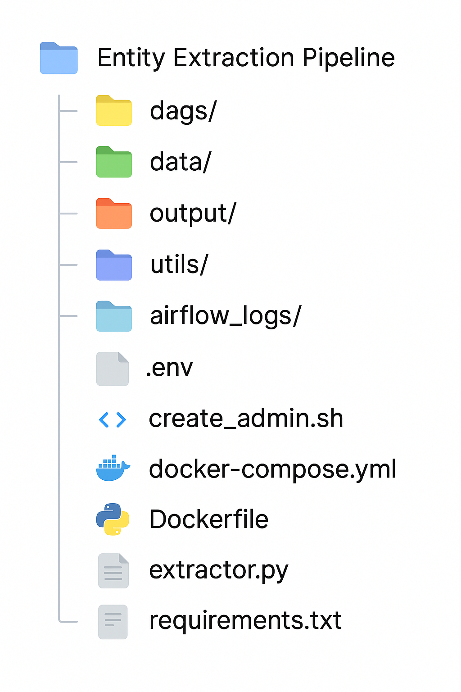

Here's the complete `README.md` file with all the details:

---

```markdown
# 🧠 Entity Extraction Pipeline with Apache Airflow + Docker

This project sets up a data engineering pipeline for entity extraction using a GLiNER-based model with Airflow, Docker, and Python.

---

## ⚙️ Setup Instructions

### 🔧 1. Prerequisites

- Docker
- Docker Compose
- Git

### 🧪 2. Clone the Repository

```bash
git clone <your-repo-url>
cd entity_extraction_pipeline
```

### 🗂 Project Structure




### 🧱 3. Build the Custom Docker Image

The custom image (`gliner-extractor`) is used by the DAG for entity extraction.

```bash
docker build -t gliner-extractor .
```

> This will package `extractor.py` and install dependencies from `requirements.txt`.

---

## 🚀 Start the Airflow Environment

```bash
docker compose up --build
```

> This will spin up:
- Airflow Webserver (localhost:8080)
- Scheduler
- Worker
- Redis (Celery broker)
- Postgres (Airflow metadata DB)

---

## 🧑‍💻 Access Airflow UI

- Visit [http://localhost:8080](http://localhost:8080)
- Login:
  - Username: `admin`
  - Password: `admin`

You should see the DAG: **`entity_extraction`**

---

## 🧾 DAG Functionality

The DAG performs:

1. **Monitoring**: Watches `/data/` directory for new CSV files.
2. **Entity Extraction**: Runs `extractor.py` inside the `gliner-extractor` Docker image.
3. **Output**: Saves results into `/output/` directory in JSON format.

Make sure you place a file like `data/sample.csv` before triggering the DAG.

---

## 📦 Adding Input Files

To test the pipeline, drop a file like `data/sample.csv` with content like:

```csv
id,text
1,Steve Jobs founded Apple in Cupertino.
2,Barack Obama was the 44th President of the United States.
```

---

## 📤 Output Format

After the pipeline finishes, check the `output/` directory for `.json` files like:

```json
[
  {
    "id": "1",
    "text": "Steve Jobs founded Apple in Cupertino.",
    "entities": [
      { "entity": "Steve Jobs", "label": "PERSON" },
      { "entity": "Apple", "label": "ORG" },
      { "entity": "Cupertino", "label": "LOC" }
    ]
  }
]
```

---

## 🧹 Clean Up

Stop all containers:

```bash
docker compose down
```

To remove volumes and start fresh:

```bash
docker compose down -v
```

---

## 📌 Notes

- The `Dockerfile` is responsible for packaging the entity extraction logic.
- You must **build the image manually** before running the pipeline (`gliner-extractor`).
- Docker volumes ensure your Airflow logs, inputs, and outputs persist locally.

---

## 📄 License

MIT License
```

---

You can copy this into your `README.md` file and use it for your project. Let me know if you'd like to adjust any of the steps!